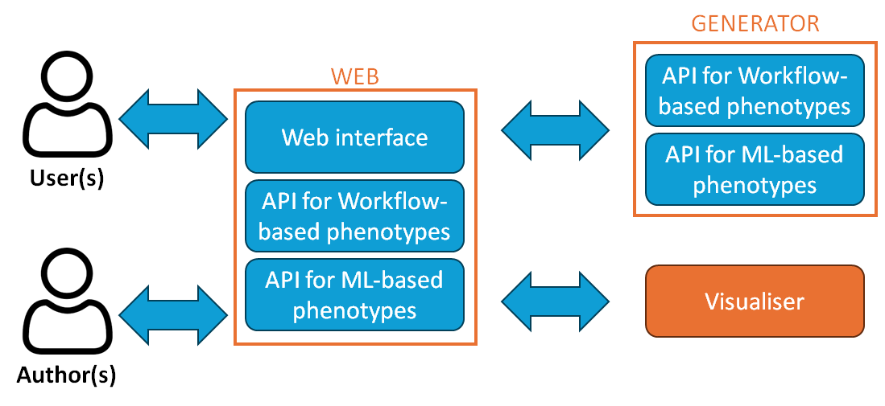

# Phenoflow-ML: a next-generation phenotyping framework to capture ML-based phenotypes

## Prerequisites

1. [Docker](https://docs.docker.com/engine/install/).
2. [Python 3](https://www.python.org/downloads/).
3. [Pip](https://pip.pypa.io/en/stable/installation/).
4. [Virtualenv](https://virtualenv.pypa.io/en/latest/installation.html).

## Configuration

### Certificate generation

1. Run [src/visualiser/git-server/certs/gen-ca-cert.sh](src/visualiser/git-server/certs/gen-ca-cert.sh).
2. Run [src/visualiser/git-server/certs/gen-domain-cert.sh](src/visualiser/git-server/certs/gen-domain-cert.sh).
3. Copy src/visualiser/git-server/certs/pf.pem to a new folder src/visualiser/spring/certs.
4. Copy src/visualiser/git-server/certs/pf.pem to a new folder src/web/certs.
5. Copy src/visualiser/git-server/certs/pf.* to [src/web/proxy/certs](src/web/proxy/certs).
6. Run [src/web/proxy/certs/gen-domain-cert.sh](src/web/proxy/certs/gen-domain-cert.sh).

### [src/web](src/web) .env (development)

1. Create a `.env` file in [src/web](src/web).

2. Generate a local development RSA private key (for JWT signing), generated by `openssl genrsa -out key.pem 2048`, and reference its location (e.g. `src/web/certs/key.pem`, if the key is generated and stored within [src/web/certs](src/web/certs)):

`RSA_PRIVATE_KEY_FULL_PATH=`

### .env (production)

1. Create a `.env` file in project root.

2. To this file, add the following, which should be chosen at random:

```
DEFAULT_PASSWORD=
MYSQL_ROOT_PASSWORD=
MYSQL_USER=
MYSQL_PASSWORD=
MYSQL_DATABASE=
```

3. In addition, add the location of a root certificate within [src/web](src/web) (e.g. '[src/web/certs/pf.pem](src/web/certs/pf.pem)'), allowing 'web' to communicate with other services:

`NODE_EXTRA_CA_CERTS=`

4. Add a deployment RSA private key name, e.g. `key.pem` (`openssl genrsa -out key.pem 2048`):

`RSA_PRIVATE_KEY=`

5. Add a path on the target deployment host to the deployment RSA private key (without the key name), e.g. `/home/ubunut/.certs/`:

`HOST_RSA_PRIVATE_KEY_PATH=`

#### DB encryption

6. Run [src/web/db/encrypt/keys/db-encryption.sh](src/web/db/encrypt/keys/db-encryption.sh).

### Misc

- Create `analytics.pug` in [src/web/views](src/web/views) (may be blank, or contain analytics script)
- Add images to [src/web/public/images](src/web/public/images) (live set available [here](https://drive.google.com/file/d/1ecZm_kBIxzXZicyAvMNHW1Tw77UWOv-K))
- Add a `.htpasswd` file to [src/web/proxy/certs](src/web/proxy/certs)
- Create [src/web/uploads](src/web/uploads)

## Development



This is an [express](https://expressjs.com/) (lightweight server) project. The majority of the logic is contained within [src/web/app.js](src/web/app.js), and in the [src/web/routes](src/web/routes) and [src/web/util](src/web/util) folders.

### Install and Run

#### Visualiser

- Local running is only available via Docker. From [src/visualiser](src/visualiser):

```
docker-compose -f docker-compose.dev.yml build
docker-compose -f docker-compose.dev.yml up -d
```

#### Generator

1. Inside [src/generator](src/generator), initialise a virtual environment, and activate:

```
virtualenv -p python3 env
. env/bin/activate
```

2. Install dependencies:

```
pip install -r requirements.txt
```

3. Run generator:

```
python main.py
```

#### Web

1. Inside [src/web](src/web), create a node virtual environment (within a python virtual environment), and activate it:

```
virtualenv env
. env/bin/activate
pip install nodeenv
nodeenv nenv
. nenv/bin/activate
```

2. Install dependencies:

```
cat requirements.txt | xargs npm install -g
```

3. Create database:

```
npm run migrate
```

4. Run server, referencing generated certificate:

```
NODE_EXTRA_CA_CERTS=certs/pf.pem npm start
```

## Deployment

1. Deployment is via Docker. If using remote machine, ensure it is activated:

```
eval $(docker-machine env [machine-name])
```

2. From the root directory, build these containers:

```
docker-compose build
```

3. Run these containers:

```
docker-compose up -d
```

4. Repeat inside [src/visualiser](src/visualiser).

## Tests

### Development

- Inside [src/web](src/web), run all tests:

`npm test`

- Run specific test(s), e.g.:

`NODE_ENV=test npx mocha -g "basic" --exit`

- Inside [src/generator](src/generator), run all tests:

`python -m unittest`

### Deployment

- From the root directory run:

```
docker-compose -f docker-compose.test.yml build;
docker-compose -f docker-compose.test.yml up;
```

[Tests can also be used to import phenotypes from different data sources](src/web/test#tests).

## Usage

### Development

The server runs by default on port 3003. Visit localhost:3003/[route] to test changes to GET endpoints and use software such as [Postman](https://www.getpostman.com/) to test changes to POST (and other) endpoints.

## License

This project is licensed under the MIT License - see the [LICENSE.md](LICENSE.md) file for details.

## Acknowledgments

* [python-cwlgen](https://github.com/kclhi/python-cwlgen).
* [cwlviewer](https://github.com/kclhi/cwlviewer).
