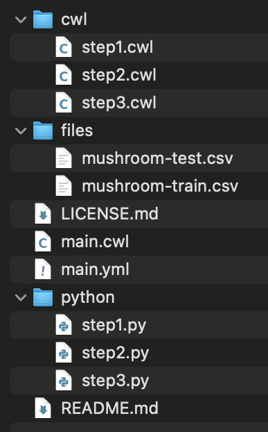

# About this document

The purpose of this document is to show an example of the creation of an ML-based phenotype definition using the well-known 'mushroom' dataset. In this example, the dataset is already preprocessed, all its attributes are of categorical type, and the attribute acting as a class is called 'class'.

In this case, the creation process is carried out by using the Phenoflow-ML API and the Postman software, which is used to send HTTP requests to the API.

# Prerequisites

Before starting with the creation of the ML-based phenotype definition, it is necessary to ensure that:

  1. The Phenoflow-ML infrastructure is properly deployed (either in our local machine or a remote server). For that, follow the steps from the README.md file of the root directory of this repository.
  2. The Postman software is installed on our machine (see https://www.postman.com/).

# Dataset preparation

The first step involves loading the preprocessed dataset into a pandas DataFrame, analysing its structure (instances, attributes, types, etc.), transforming all the attributes (except the class) to numeric type, and splitting it into 'train' and 'test' datasets. For that, the following Python code must be executed:

```python
import pandas as pd
from sklearn.preprocessing import OrdinalEncoder
from sklearn.model_selection import train_test_split

# Load the dataset.
dataset = pd.read_csv("mushroom.csv")

# Show its characteristics.
dataset # Complete dataset (with number of instances and attributes).
dataset.columns # Attributes.
dataset.dtypes # Attribute types.
# Number of instances: 8124.
# Number of attributes (including the class): 22.

# Transform all attributes (except the class) to numeric.
numeric_dataset = dataset.copy() # Copy the dataset.
enc = OrdinalEncoder() # Encoder object.
numeric_dataset = pd.DataFrame( enc.fit_transform(numeric_dataset) ) # Transform all attributes to numeric.
numeric_dataset.columns = dataset.columns # Restore the original attribute names.
numeric_dataset["class"] = dataset["class"] # Restore the original class attribute.
enc.categories_ # Show the categories assigned by the encoder.
numeric_dataset # Show the final numeric dataset.

# Create the 'train' and 'test' datasets.
X = numeric_dataset.drop(columns = ["class"])
y = numeric_dataset["class"]
X_train, X_test, y_train, y_test = train_test_split(X, y, test_size = 0.3, random_state = 100) # Train: 70% ; Test: 30%.
train_dataset = X_train.copy()
train_dataset["class"] = y_train
test_dataset = X_test.copy()
test_dataset["class"] = y_test

# Save both datasets.
train_dataset.to_csv("mushroom-train.csv", index = False)
test_dataset.to_csv("mushroom-test.csv", index = False)
```

The following images show the attributes from the dataset and some instances before and after the transformation:


# Creation of the ML-based phenotype definition

The next step consists of creating a ML-based phenotype definition of the desired type in the Phenoflow-ML infrastructure. In this example, we use the Logistic Regression phenotype type.

A creation example of this phenotype type can be found at [examples/ml-based-phenotypes/LogisticRegression](../../ml-based-phenotypes/LogisticRegression/README.md).

After the creation, the downloaded ZIP file contains all the needed files for the correct execution of the ML-based phenotype definition and its content is shown in the following image:



We can see different files and directories: the main files for the ML-based phenotype definition execution (main.cwl and main.yml), some informative files (such as README.md and LICENSE.md), the 'cwl' directory, which contains the specific cwl files for each step, the 'files' directory, which contains the necessary input files for the ML-based phenotype definition (for example, the datasets), and the 'python' directory, which contains the code for for each step (Python code in this case).

# Execution of the ML-based phenotype definition

The Common Workflow Language (CWL) defines and describes portable, reusable and implementation-neutral workflows. Therefore, a specific CWL implementation is necessary in order to execute the created ML-based phenotype definitions (see https://www.commonwl.org/implementations/). In this example, we use 'cwltool' (a command-line tool) because it is the implementation of reference.

When downloading and unzipping the ZIP file of our ML-based phenotype definition, the following command executes the ML-based phenotype definition:

```
cwltool main.cwl main.yml
```

Remember that Docker also needs to be installed and running when executing cwltool.

After the execution, the new content of the folder is shown in the following image:


Now, three new files have been created: (1) the fitted model in pickle format, (2) the train dataset with the predictions generated by the Logistic Regression model, and (3) the test dataset with the predictions generated by the Logistic Regression model.

The following image shows the attributes from these new datasets and some instances:


In addition to the attribute indicating the row index, a new attribute called "class_pred" has been added to the dataset. This attribute contains the predictions.
