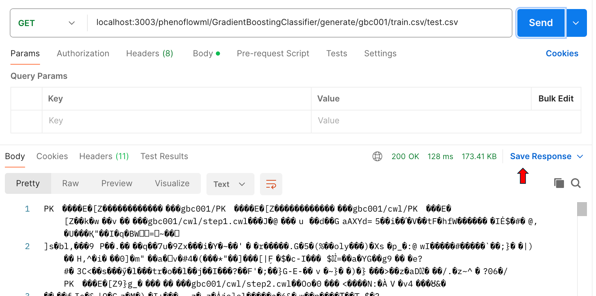

# About this document

The purpose of this document is to show an example of the creation of an ML phenotype definition based on the Gradient Boosting Classifier phenotype type.

In this case, the creation process is carried out by using the Phenoflow-ML API and the Postman software, which is used to send HTTP requests to such API.

# Prerequisites

Before starting with the creation of the ML-based phenotype definition, it is necessary to ensure that:

  1. The Phenoflow-ML infrastructure is properly deployed (either in our local machine or a remote server). For that, follow the steps from the README.md file of the root directory of this repository.
  2. The Postman software is installed on our machine (see https://www.postman.com/).

# Creation process

The creation process is divided into three steps: (1) add a new Gradient Boosting Classifier phenotype, (2) upload the necessary CSV datasets (train and test), and (3) generate the corresponding phenotype files.

## 1. Add a new Gradient Boosting Classifier phenotype

The first step consists of creating a new definition of the Gradient Boosting Classifier, which implies adding all the necessary components to the system (workflow, steps, inputs, outputs, etc.). For that, the **addPhenotype** endpoint is used, which is of type POST and takes different parameters (in the form-data) as input. An example is shown as follows:

## 2. Upload the necessary CSV datasets

When the definition is created, the next step consists of uploading both datasets (train and test) to the system. For that, the **uploadCsvDataset** endpoint is used. It is of type POST and takes different parameters (in the form-data) as input. An example is shown as follows:

## 3. Generate the phenotype files

The last step is to generate and download the CWL workflow. For that, the **generate** endpoint is used. This endpoint is of GET type and contains different parameters, that need to be added to the URL. When executing this endpoint, the templates of the Gradient Boosting Classifier technique are customized with the properties stored in the system of the current Gradient Boosting Classifier phenotype. An example is shown as follows:

# Visualization

Once the ML-based phenotype definition is generated, it can be visualized using the *visualiser* component.

